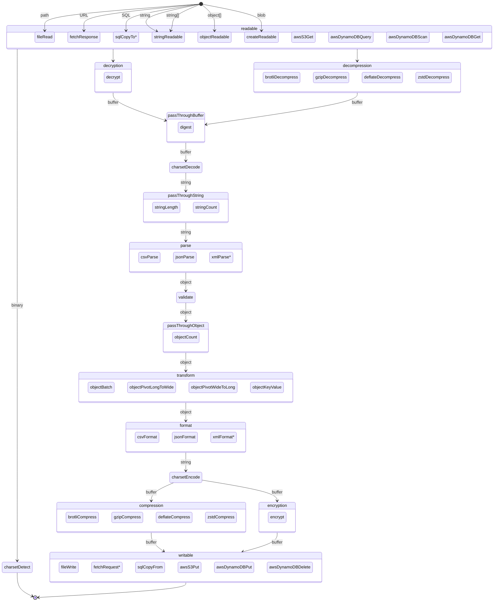

<div align="center">
<!--<br/><br/><br/><br/><br/><br/><br/>
<br/><br/><br/><br/><br/><br/><br/>-->
<h1>&lt;datastream&gt;</h1>
<p>Commonly used stream patterns for Web Streams API and NodeJS Stream.</p>
<p>If you're iterating over an array more than once, it's time to use streams.</p>
<br />
<p>
  <a href="https://github.com/willfarrell/datastream/actions/workflows/test-unit.yml"></a>
  <a href="https://github.com/willfarrell/datastream/actions/workflows/test-dast.yml"></a>
  <a href="https://github.com/willfarrell/datastream/actions/workflows/test-perf.yml"></a>
  <a href="https://github.com/willfarrell/datastream/actions/workflows/test-sast.yml"></a>
  <a href="https://github.com/willfarrell/datastream/actions/workflows/test-lint.yml"></a>
  <br/>
  <a href="https://www.npmjs.com/package/@datastream/core"></a>
  <a href="https://packagephobia.com/result?p=@datastream/core"></a>
  <a href="https://www.npmjs.com/package/@datastream/core">
  </a>
  <a href="https://www.npmjs.com/package/@datastream/core#provenance">
  </a>
  <br/>
  <a href="https://scorecard.dev/viewer/?uri=github.com/willfarrell/datastream"></a>
  <a href="https://slsa.dev"></a>
  <a href="https://github.com/willfarrell/datastream/blob/main/.github/CODE_OF_CONDUCT.md"></a>
  <a href="https://biomejs.dev"></a>
  <a href="https://conventionalcommits.org"></a>
  <a href="https://github.com/willfarrell/datastream/blob/main/package.json#L25">
  </a>
</p>
</div>

- [`@datastream/core`](packages/core)
  - pipeline
  - pipejoin
  - result
  - streamToArray
  - streamToObject
  - streamToString
  - streamToBuffer
  - isReadable
  - isWritable
  - makeOptions
  - createReadableStream
  - createPassThroughStream
  - createTransformStream
  - createWritableStream
  - resolveLazy
  - shallowClone
  - deepClone
  - shallowEqual
  - deepEqual
  - timeout
  - createReadableStreamFromString (Node only)
  - createReadableStreamFromArrayBuffer (Node only)
  - backpressureGauge (Node only)

## Streams

- Readable: The start of a pipeline of streams that injects data into a stream.
- PassThrough: Does not modify the data, but listens to the data and prepares a result that can be retrieved.
- Transform: Modifies data as it passes through.
- Writable: The end of a pipeline of streams that stores data from the stream.

### Basics

- [`@datastream/string`](packages/string)
  - stringReadableStream [Readable]
  - stringLengthStream [PassThrough]
  - stringCountStream [PassThrough]
  - stringMinimumFirstChunkSize [Transform]
  - stringMinimumChunkSize [Transform]
  - stringSkipConsecutiveDuplicates [Transform]
  - stringReplaceStream [Transform]
  - stringSplitStream [Transform]
- [`@datastream/object`](packages/object)
  - objectReadableStream [Readable]
  - objectCountStream [PassThrough]
  - objectBatchStream [Transform]
  - objectPivotLongToWideStream [Transform]
  - objectPivotWideToLongStream [Transform]
  - objectKeyValueStream [Transform]
  - objectKeyValuesStream [Transform]
  - objectKeyJoinStream [Transform]
  - objectKeyMapStream [Transform]
  - objectValueMapStream [Transform]
  - objectPickStream [Transform]
  - objectOmitStream [Transform]
  - objectFromEntriesStream [Transform]
  - objectToEntriesStream [Transform]
  - objectSkipConsecutiveDuplicatesStream [Transform]

### Common

- [`@datastream/file`](packages/file)
  - fileReadStream [Readable]
  - fileWriteStream [Writable]
- [`@datastream/fetch`](packages/fetch)
  - fetchResponseStream [Readable]
- [`@datastream/base64`](packages/base64)
  - base64EncodeStream [Transform]
  - base64DecodeStream [Transform]
- [`@datastream/charset[/{detect,decode,encode}]`](packages/charset)
  - charsetDetectStream [PassThrough]
  - charsetDecodeStream [Transform]
  - charsetEncodeStream [Transform]
- [`@datastream/compress[/{gzip,deflate,brotli,zstd}]`](packages/compress)
  - gzipCompressStream [Transform]
  - gzipDecompressStream [Transform]
  - deflateCompressStream [Transform]
  - deflateDecompressStream [Transform]
  - brotliCompressStream [Transform]
  - brotliDecompressStream [Transform]
  - zstdCompressStream [Transform]
  - zstdDecompressStream [Transform]
- [`@datastream/digest`](packages/digest)
  - digestStream [PassThrough]

### Advanced

- [`@datastream/csv[/{parse,format}]`](packages/csv)
  - csvParseStream [Transform]
  - csvFormatStream [Transform]
- [`@datastream/json`](packages/json)
  - jsonParseStream [Transform]
  - jsonFormatStream [Transform]
  - ndjsonParseStream [Transform]
  - ndjsonFormatStream [Transform]
- [`@datastream/encrypt`](packages/encrypt)
  - encryptStream [Transform]
  - decryptStream [Transform]
  - generateEncryptionKey
- [`@datastream/validate`](packages/validate)
  - validateStream [Transform]
- [`@datastream/arrow`](packages/arrow)
  - arrowDetectSchemaStream [PassThrough]
  - arrowBatchFromArrayStream [Transform]
  - arrowBatchFromObjectStream [Transform]
  - arrowToArrayStream [Transform]
  - arrowToObjectStream [Transform]
- [`@datastream/duckdb`](packages/duckdb)
  - duckdbAppenderStream [Writable]
  - duckdbArrowInsertStream [Writable]
- [`@datastream/indexeddb`](packages/indexeddb)
  - indexedDBReadStream [Readable]
  - indexedDBWriteStream [Writable]
- [`@datastream/ipfs`](packages/ipfs)
  - ipfsGetStream [Readable]
  - ipfsAddStream [Writable]
- [`@datastream/protobuf`](packages/protobuf)
  - protobufEncodeStream [Transform]
  - protobufDecodeStream [Transform]
  - protobufLengthPrefixFrameStream [Transform]
  - protobufLengthPrefixUnframeStream [Transform]
- [`@datastream/schema-registry`](packages/schema-registry)
  - confluentFrameStream [Transform]
  - confluentUnframeStream [Transform]
  - glueFrameStream [Transform]
  - glueUnframeStream [Transform]
- [`@datastream/kafka`](packages/kafka)
  - kafkaConsumeStream [Readable]
  - kafkaProduceStream [Writable]
- [`@datastream/aws/msk-iam`](packages/aws)
  - awsMskIamMechanism (kafkajs OAUTHBEARER SASL config)
- [`@datastream/aws/glue-schema-registry`](packages/aws)
  - awsGlueSchemaRegistryResolver (cached GetSchemaVersion lookup)

## Setup

```bash
npm install @datastream/core @datastream/{module}
```

## Flows



\* possible future package

## Write your own

### Readable

#### NodeJS Streams

- [NodeJS](https://nodejs.org/api/stream.html#class-streamreadable)

#### Web Streams API

- [MDN](https://developer.mozilla.org/en-US/docs/Web/API/ReadableStream)
- [NodeJS](https://nodejs.org/api/webstreams.html#class-readablestream)

### Transform

#### NodeJS Streams

- [NodeJS](https://nodejs.org/api/stream.html#class-streamtransform)

#### Web Streams API

- [MDN](https://developer.mozilla.org/en-US/docs/Web/API/TransformStream)
- [NodeJS](https://nodejs.org/api/webstreams.html#class-transformstream)

### Writeable

#### NodeJS Streams

- [NodeJS](https://nodejs.org/api/stream.html#class-streamwritable)

#### Web Streams API

- [MDN](https://developer.mozilla.org/en-US/docs/Web/API/WritableStream)
- [NodeJS](https://nodejs.org/api/webstreams.html#class-writablestream)

## End-to-End Examples

### NodeJS: Import CSV into SQL database

Read a CSV file, validate the structure, pivot data, then save compressed.

- fs.creatReadStream
- gzip
- cryptoDigest
- charsetDecode
- csvParse
- countChunks
- validate
- changeCase (pascal to snake)
- parquet?
- csvFormat
- postgesCopyFrom

### WebWorker: Validate and collect metadata about file prior to upload

- <input type="file">
- cryptoDigest
- charsetDetect
- jsonParse?
- validate

### WebWorker: Upload file compressed

Upload file with brotli compression?

### WebWorker: Decode protobuf-encoded requests into JSON

Fetch a protobuf-encoded file, decode the protobuf framing, then parse JSON

### streams

- filter

- file (docs only?)

### examples

- fetch
- node:fs
- input type=file
- readable string/array/etc

## License

Licensed under [MIT License](LICENSE). Copyright (c) 2026 [will Farrell](https://github.com/willfarrell) and [contributors](https://github.com/willfarrell/datastream/graphs/contributors).
