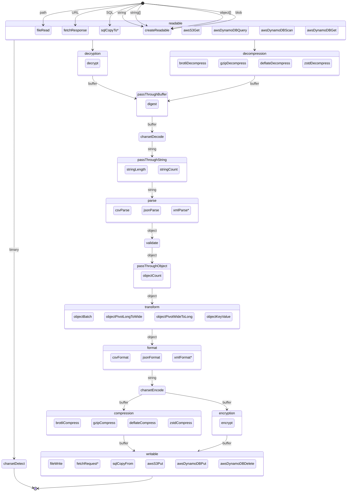

<div align="center">
<!--<br/><br/><br/><br/><br/><br/><br/>
<br/><br/><br/><br/><br/><br/><br/>-->
<h1>&lt;datastream&gt;</h1>
<p>Commonly used stream patterns for Web Streams API and NodeJS Stream.</p>
<p>If you're iterating over an array more than once, it's time to use streams.</p>
<br />
<p>
  <a href="https://github.com/willfarrell/datastream/actions/workflows/test-unit.yml"></a>
  <a href="https://github.com/willfarrell/datastream/actions/workflows/test-dast.yml"></a>
  <a href="https://github.com/willfarrell/datastream/actions/workflows/test-bench.yml"></a>
  <a href="https://github.com/willfarrell/datastream/actions/workflows/test-sast.yml"></a>
  <a href="https://github.com/willfarrell/datastream/actions/workflows/test-lint.yml"></a>
  <br/>
  <a href="https://www.npmjs.com/package/@datastream/core"></a>
  <a href="https://packagephobia.com/result?p=@datastream/core"></a>
  <a href="https://www.npmjs.com/package/@datastream/core">
  </a>
  <a href="https://www.npmjs.com/package/@datastream/core#provenance">
  </a>
  <br/>
  <a href="https://scorecard.dev/viewer/?uri=github.com/willfarrell/datastream"></a>
  <a href="https://slsa.dev"></a>
  <a href="https://github.com/willfarrell/datastream/blob/main/.github/CODE_OF_CONDUCT.md"></a>
  <a href="https://biomejs.dev"></a>
  <a href="https://conventionalcommits.org"></a>
  <a href="https://github.com/willfarrell/datastream/blob/main/package.json#L25">
  </a>
</p>
</div>

- [`@datastream/core`](packages/core)
  - pipeline
  - pipejoin
  - result
  - streamToArray
  - streamToObject
  - streamToString
  - streamToBuffer
  - isReadable
  - isWritable
  - makeOptions
  - createReadableStream
  - createPassThroughStream
  - createTransformStream
  - createWritableStream
  - resolveLazy
  - timeout
  - backpressureGauge (Node only)

## Streams

- Readable: The start of a pipeline of streams that injects data into a stream.
- PassThrough: Does not modify the data, but listens to the data and prepares a result that can be retrieved.
- Transform: Modifies data as it passes through.
- Writable: The end of a pipeline of streams that stores data from the stream.

### Basics

- [`@datastream/string`](packages/string)
  - stringLengthStream [PassThrough]
  - stringCountStream [PassThrough]
  - stringMinimumFirstChunkSizeStream [Transform]
  - stringMinimumChunkSizeStream [Transform]
  - stringSkipConsecutiveDuplicatesStream [Transform]
  - stringReplaceStream [Transform]
  - stringSplitStream [Transform]
- [`@datastream/object`](packages/object)
  - objectCountStream [PassThrough]
  - objectBatchStream [Transform]
  - objectPivotLongToWideStream [Transform]
  - objectPivotWideToLongStream [Transform]
  - objectKeyValueStream [Transform]
  - objectKeyValuesStream [Transform]
  - objectKeyJoinStream [Transform]
  - objectKeyMapStream [Transform]
  - objectValueMapStream [Transform]
  - objectPickStream [Transform]
  - objectOmitStream [Transform]
  - objectFromEntriesStream [Transform]
  - objectToEntriesStream [Transform]
  - objectSkipConsecutiveDuplicatesStream [Transform]

### Common

- [`@datastream/file`](packages/file)
  - fileReadStream [Readable]
  - fileWriteStream [Writable]
- [`@datastream/fetch`](packages/fetch)
  - fetchReadableStream (alias fetchResponseStream) [Readable]
  - fetchWritableStream (alias fetchRequestStream) [Writable]
- [`@datastream/base64`](packages/base64)
  - base64EncodeStream [Transform]
  - base64DecodeStream [Transform]
- [`@datastream/charset[/{detect,decode,encode}]`](packages/charset)
  - charsetDetectStream [PassThrough]
  - charsetDecodeStream [Transform]
  - charsetEncodeStream [Transform]
- [`@datastream/compress[/{gzip,deflate,brotli,zstd}]`](packages/compress)
  - gzipCompressStream [Transform]
  - gzipDecompressStream [Transform]
  - deflateCompressStream [Transform]
  - deflateDecompressStream [Transform]
  - brotliCompressStream [Transform]
  - brotliDecompressStream [Transform]
  - zstdCompressStream [Transform] (Node only)
  - zstdDecompressStream [Transform] (Node only)
- [`@datastream/digest`](packages/digest)
  - digestStream [PassThrough]

### Advanced

- [`@datastream/csv`](packages/csv)
  - csvDetectDelimitersStream [PassThrough]
  - csvDetectHeaderStream [PassThrough]
  - csvParseStream [Transform]
  - csvRemoveEmptyRowsStream [Transform]
  - csvRemoveMalformedRowsStream [Transform]
  - csvCoerceValuesStream [Transform]
  - csvArrayToObjectStream [Transform]
  - csvObjectToArrayStream [Transform]
  - csvInjectHeaderStream [Transform]
  - csvFormatStream [Transform]
- [`@datastream/json`](packages/json)
  - jsonParseStream [Transform]
  - jsonFormatStream [Transform]
  - ndjsonParseStream [Transform]
  - ndjsonFormatStream [Transform]
- [`@datastream/encrypt`](packages/encrypt)
  - encryptStream [Transform]
  - decryptStream [Transform]
  - generateEncryptionKey
- [`@datastream/validate`](packages/validate)
  - validateStream [Transform]
- [`@datastream/arrow`](packages/arrow)
  - arrowDetectSchemaStream [PassThrough]
  - arrowBatchFromArrayStream [Transform]
  - arrowBatchFromObjectStream [Transform]
  - arrowToArrayStream [Transform]
  - arrowToObjectStream [Transform]
- [`@datastream/duckdb`](packages/duckdb)
  - duckdbConnect (connection helper)
  - duckdbAppenderStream [Writable]
  - duckdbArrowInsertStream [Writable]
- [`@datastream/indexeddb`](packages/indexeddb) (browser only)
  - indexedDBReadStream [Readable]
  - indexedDBWriteStream [Writable]
- [`@datastream/ipfs`](packages/ipfs)
  - ipfsGetStream [Readable]
  - ipfsAddStream [Writable]
- [`@datastream/protobuf`](packages/protobuf)
  - protobufEncodeStream [Transform]
  - protobufDecodeStream [Transform]
  - protobufLengthPrefixFrameStream [Transform]
  - protobufLengthPrefixUnframeStream [Transform]
- [`@datastream/schema-registry`](packages/schema-registry)
  - confluentFrameStream [Transform]
  - confluentUnframeStream [Transform]
  - glueFrameStream [Transform]
  - glueUnframeStream [Transform]
- [`@datastream/kafka`](packages/kafka) (Node only)
  - kafkaConnect (producer/consumer connection helper)
  - kafkaConsumeStream [Readable]
  - kafkaProduceStream [Writable]
- [`@datastream/aws/{cloudwatch-logs,dynamodb,dynamodb-streams,kinesis,lambda,s3,sns,sqs}`](packages/aws) (Node only; import from the subpath)
  - awsCloudWatchLogsGetLogEventsStream [Readable]
  - awsCloudWatchLogsFilterLogEventsStream [Readable]
  - awsDynamoDBQueryStream [Readable]
  - awsDynamoDBScanStream [Readable]
  - awsDynamoDBExecuteStatementStream [Readable]
  - awsDynamoDBGetItemStream [Readable]
  - awsDynamoDBPutItemStream [Writable]
  - awsDynamoDBDeleteItemStream [Writable]
  - awsDynamoDBStreamsGetRecordsStream [Readable]
  - awsKinesisGetRecordsStream [Readable]
  - awsKinesisPutRecordsStream [Writable]
  - awsLambdaReadableStream [Readable]
  - awsS3GetObjectStream [Readable]
  - awsS3PutObjectStream [PassThrough]
  - awsS3ChecksumStream [PassThrough]
  - awsSNSPublishMessageStream [Writable]
  - awsSQSReceiveMessageStream [Readable]
  - awsSQSSendMessageStream [Writable]
  - awsSQSDeleteMessageStream [Writable]
- [`@datastream/aws/msk-iam`](packages/aws)
  - awsMskIamMechanism (kafkajs OAUTHBEARER SASL config)
- [`@datastream/aws/glue-schema-registry`](packages/aws)
  - awsGlueSchemaRegistryResolver (cached GetSchemaVersion lookup)
- [`@datastream/azure/{blob,cosmos,event-hubs,queue,service-bus}`](packages/azure) (Node only)
  - azureBlobDownloadStream [Readable]
  - azureBlobUploadStream [PassThrough]
  - azureCosmosQueryStream [Readable]
  - azureCosmosUpsertItemStream [Writable]
  - azureCosmosDeleteItemStream [Writable]
  - azureEventHubsReceiveEventsStream [Readable]
  - azureEventHubsSendEventsStream [Writable]
  - azureQueueReceiveMessagesStream [Readable]
  - azureQueueSendMessageStream [Writable]
  - azureQueueDeleteMessageStream [Writable]
  - azureServiceBusReceiveMessagesStream [Readable]
  - azureServiceBusSendMessagesStream [Writable]
  - azureServiceBusCompleteMessageStream [Writable]
- [`@datastream/azure/event-hubs-kafka`](packages/azure)
  - azureEventHubsKafkaMechanism (kafkajs OAUTHBEARER SASL config for Entra ID)

## Setup

```bash
npm install @datastream/core @datastream/{module}
```

## Upgrading to the next major

Every package has breaking changes. Upgrade all `@datastream/*` packages together.

### All packages

- Node.js 26 or newer is required.
- No default exports. Use named imports: `import { csvParseStream } from '@datastream/csv'`.
- The web build moved from `index.web.mjs` and the `/webstream` subpath to the `browser` export condition and the `/browser` subpath (for example `@datastream/core/browser`).
- Features a platform can't support have no build for it: `@datastream/aws` and `@datastream/kafka` are Node.js only, `@datastream/indexeddb` is browser only, and zstd in `@datastream/compress` is Node.js only.
- Limit options (`maxBufferSize`, `maxFieldSize`, `maxInputSize`, `maxOutputSize`, `maxMessageSize`, `maxErrorRows`, `maxPages`, `maxBodySize`, ...): `undefined` means the documented default, `null` means unlimited, and going over a limit throws a `RangeError`.
- Every stream factory name ends in `Stream`.

### Per package

- **core**
  - `pipejoin(streams, onError)`: `onError` is gone. Errors surface on the returned stream.
  - `createReadableStreamFromString` and `createReadableStreamFromArrayBuffer` are gone. Use `createReadableStream`, which accepts strings, arrays, iterables, `ArrayBuffer`s and typed arrays.
  - `shallowClone`, `deepClone`, `shallowEqual` and `deepEqual` are no longer exported.
  - `backpressureGauge` is not exported by the browser build.
  - `streamTo*` `maxBufferSize` accepts `null` and throws a `RangeError`.
  - `createWritableStream` takes a new `abort(reason)` option.
  - `streamOptions.chunkSize` only sets the slice size of `createReadableStream`.
- **string**
  - `stringReadableStream` is gone. Use `createReadableStream`.
  - Only the `*Stream` names remain: `stringMinimumFirstChunkSizeStream`, `stringMinimumChunkSizeStream`, `stringSkipConsecutiveDuplicatesStream`.
  - The `stringCountStream` result key is now `stringCount`.
- **object**
  - `objectReadableStream` is gone. Use `createReadableStream`.
  - The `objectCountStream` result key is now `objectCount`.
- **csv**
  - `csvArrayToObject` is now `csvArrayToObjectStream`, and `csvObjectToArray` is now `csvObjectToArrayStream`.
  - `fieldMaxSize` is now `maxFieldSize`. The `chunkSize` option is gone.
  - `csvCoerceValuesStream` no longer adds a result entry.
  - `csvFormatStream` escapes formula-like cells by default (`escapeFormulae: true`).
  - Error streams keep at most `maxErrorRows` row indexes per error (default 1000). Each error also has a `count` with the true total.
- **json**
  - The `ndjsonParseStream` result key is now `ndjsonErrors`. `jsonParseStream` keeps `jsonErrors`.
  - Error entries have a `count`, and `maxErrorRows` defaults to 1000.
- **validate**
  - `maxErrorRows` defaults to 1000 (was unlimited). `maxErrorKeys` (default 1000) caps the number of distinct errors.
- **file**, **encrypt**
  - `fileReadStream`, `fileWriteStream`, `encryptStream` and `decryptStream` return a Promise in every build. Always `await` them.
- **digest**
  - `digestStream` returns the stream directly in both builds.
- **fetch**
  - `concurrency` moved from `streamOptions` to the fetch options.
  - `fetchWritableStream` takes a `resultKey` option (default `output`).
  - New limits: `maxPages` (default 10,000), `maxBodySize` (default 16 MiB), `retryAfterMax` (default 60 s).
- **compress**
  - zstd is Node.js only. The browser build does not export the zstd streams, and `@datastream/compress/zstd` has no browser build.
- **kafka**
  - Node.js only.
  - `signal` moved from the `kafkaConsumeStream` options to `streamOptions`.
  - `autoCommit` defaults to `false`. Commit offsets after processing, or pass `autoCommit: true`.
- **protobuf**
  - `protobufDecodeStream` `maxOutputSize` is now `maxMessageSize`. It is checked per message.
- **schema-registry**
  - `glueUnframeStream` `maxDecompressedBytes` is now `maxOutputSize`, and `glueFrameStream` also takes `maxOutputSize` (default 256 MiB for both).
  - The frame stream result keys are now `confluentFrameSchemaId` and `glueFrameSchemaVersionId`. The unframe streams keep `confluentSchemaId` and `glueSchemaVersionId`.
  - Each chunk must hold exactly one whole frame. Frames split across chunks are not reassembled.
- **indexeddb**
  - Browser only. The Node.js stub is gone.

## Flows


```mermaid
stateDiagram-v2

    [*] --> fileRead: path
    [*] --> fetchResponse: URL
    [*] --> sqlCopyTo*: SQL
    [*] --> createReadable: string
    [*] --> createReadable: string[]
    [*] --> createReadable: object[]
    [*] --> createReadable: blob

    readable --> charsetDetect: binary
    charsetDetect --> [*]

    readable --> decryption
    decryption --> passThroughBuffer: buffer

    readable --> decompression
    decompression --> passThroughBuffer: buffer
    passThroughBuffer --> charsetDecode: buffer
    charsetDecode --> passThroughString: string
    passThroughString --> parse: string
    parse --> validate: object
    validate --> passThroughObject: object
    passThroughObject --> transform: object

    transform --> format: object
    format --> charsetEncode: string
    charsetEncode --> compression: buffer
    compression --> writable: buffer

    charsetEncode --> encryption: buffer
    encryption --> writable: buffer

    state readable {
        fileRead
        fetchResponse
        sqlCopyTo*
        createReadable
        awsS3Get
        awsDynamoDBQuery
        awsDynamoDBScan
        awsDynamoDBGet
    }

    state decompression {
        brotliDecompress
        gzipDecompress
        deflateDecompress
        zstdDecompress
    }

    state decryption {
      decrypt
    }

    state parse {
      csvParse
      jsonParse
      xmlParse*
    }

    state passThroughBuffer {
      digest
    }

    state passThroughString {
      stringLength
      stringCount
    }

    state passThroughObject {
      objectCount
      objectBatch
    }

    state transform {
      objectBatch
      objectPivotLongToWide
      objectPivotWideToLong
      objectKeyValue
      objectKeyValue
    }

    state format {
      csvFormat
      jsonFormat
      xmlFormat*
    }

    state compression {
        brotliCompress
        gzipCompress
        deflateCompress
        zstdCompress
    }

    state encryption {
      encrypt
    }

    state writable {
        fileWrite
        fetchRequest*
        sqlCopyFrom
        awsS3Put
        awsDynamoDBPut
        awsDynamoDBDelete
    }
    writable --> [*]
```

\* possible future package

## Write your own

### Readable

#### NodeJS Streams

- [NodeJS](https://nodejs.org/api/stream.html#class-streamreadable)

#### Web Streams API

- [MDN](https://developer.mozilla.org/en-US/docs/Web/API/ReadableStream)
- [NodeJS](https://nodejs.org/api/webstreams.html#class-readablestream)

### Transform

#### NodeJS Streams

- [NodeJS](https://nodejs.org/api/stream.html#class-streamtransform)

#### Web Streams API

- [MDN](https://developer.mozilla.org/en-US/docs/Web/API/TransformStream)
- [NodeJS](https://nodejs.org/api/webstreams.html#class-transformstream)

### Writeable

#### NodeJS Streams

- [NodeJS](https://nodejs.org/api/stream.html#class-streamwritable)

#### Web Streams API

- [MDN](https://developer.mozilla.org/en-US/docs/Web/API/WritableStream)
- [NodeJS](https://nodejs.org/api/webstreams.html#class-writablestream)

## End-to-End Examples

### NodeJS: Import CSV into SQL database

Read a CSV file, validate the structure, pivot data, then save compressed.

- fs.creatReadStream
- gzip
- cryptoDigest
- charsetDecode
- csvParse
- countChunks
- validate
- changeCase (pascal to snake)
- parquet?
- csvFormat
- postgesCopyFrom

### WebWorker: Validate and collect metadata about file prior to upload

- <input type="file">
- cryptoDigest
- charsetDetect
- jsonParse?
- validate

### WebWorker: Upload file compressed

Upload file with brotli compression?

### WebWorker: Decode protobuf-encoded requests into JSON

Fetch a protobuf-encoded file, decode the protobuf framing, then parse JSON

### streams

- filter

- file (docs only?)

### examples

- fetch
- node:fs
- input type=file
- readable string/array/etc

## License

Licensed under [MIT License](LICENSE). Copyright (c) 2026 [will Farrell](https://github.com/willfarrell) and [contributors](https://github.com/willfarrell/datastream/graphs/contributors).
