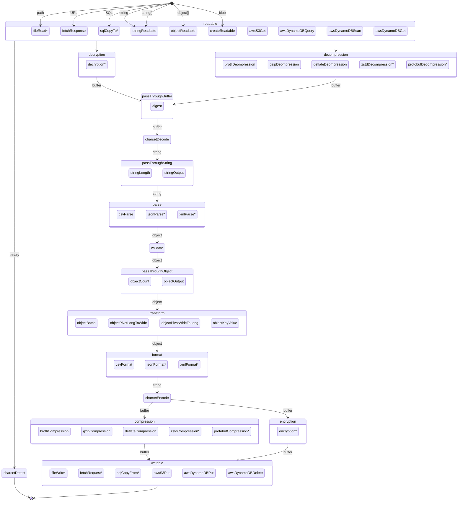

<div align="center">
<!--<br/><br/><br/><br/><br/><br/><br/>
<br/><br/><br/><br/><br/><br/><br/>-->
<h1>&lt;datastream&gt;</h1>
<p>Commonly used stream patterns for Web Streams API and NodeJS Stream.</p>
<p>If you're iterating over an array more than once, it's time to use streams.</p>
<br />
<p>
  <a href="https://www.npmjs.com/package/@datastream/core?activeTab=versions">
    
  </a>
  <a href="https://packagephobia.com/result?p=@datastream/core">
    
  </a>
  <!--<a href="https://github.com/willfarrell/datastream/actions/workflows/tests.yml">
    
  </a>-->
  <br/>
   <a href="https://standardjs.com/">
    
  </a>
  <!--<a href="https://snyk.io/test/github/willfarrell/datastream">
    
  </a>
  <a href="https://github.com/willfarrell/datastream/actions/workflows/sast.yml">
    
  </a>
  <a href="https://bestpractices.coreinfrastructure.org/projects/0000">
    
  </a>-->
</p>
</div>

Warning: This library is in Alpha, and will contain breaking changes as modules mature to have consistent usage patterns.

- [`@datastream/core`](#core)
  - pipeline
  - pipejoin
  - streamToArray
  - streamToString
  - isReadable
  - isWritable
  - makeOptions
  - createReadableStream
  - createTransformStream
  - createWritableStream

## Streams

- Readable: The start of a pipeline of streams that injects data into a stream.
- PassThrough: Does not modify the data, but listens to the data and prepares a result that can be retrieved.
- Transform: Modifies data as it passes through.
- Writable: The end of a pipeline of streams that stores data from the stream.

### Basics

- [`@datastream/string`](#string)
  - stringReadableStream [Readable]
  - stringLengthStream [PassThrough]
  - stringOutputStream [PassThrough]
- [`@datastream/object`](#object)
  - objectReadableStream [Readable]
  - objectCountStream [PassThrough]
  - objectBatchStream [Transform]
  - objectOutputStream [PassThrough]

### Common

- [`@datastream/fetch`](#fetch)
  - fetchResponseStream [Readable]
- [`@datastream/charset[/{detect,decode,encode}]`](#charset)
  - charsetDetectStream [PassThrough]
  - charsetDecodeStream [Transform]
  - charsetEncodeStream [Transform]
- [`@datastream/compression[/{gzip,deflate}]`](#compression)
  - gzipCompressionStream [Transform]
  - gzipDecompressionStream [Transform]
  - deflateCompressionStream [Transform]
  - deflateDecompressionStream [Transform]
- [`@datastream/digest`](#digest)
  - digestStream [PassThrough]

### Advanced

- [`@datastream/csv[/{parse,format}]`](#csv)
  - csvParseStream [Transform]
  - csvFormatStream [Transform]
- [`@datastream/validate`](#validate)
  - validateStream [Transform]

## Setup

```bash
npm install @datastream/core @datastream/{module}
```

## Flows



\* possible future package

## Write your own

### Readable

#### NodeJS Streams

- [NodeJS](https://nodejs.org/api/stream.html#class-streamreadable)

#### Web Streams API

- [MDN](https://developer.mozilla.org/en-US/docs/Web/API/ReadableStream)
- [NodeJS](https://nodejs.org/api/webstreams.html#class-readablestream)

### Transform

#### NodeJS Streams

- [NodeJS](https://nodejs.org/api/stream.html#class-streamtransform)

#### Web Streams API

- [MDN](https://developer.mozilla.org/en-US/docs/Web/API/TransformStream)
- [NodeJS](https://nodejs.org/api/webstreams.html#class-transformstream)

### Writeable

#### NodeJS Streams

- [NodeJS](https://nodejs.org/api/stream.html#class-streamwritable)

#### Web Streams API

- [MDN](https://developer.mozilla.org/en-US/docs/Web/API/WritableStream)
- [NodeJS](https://nodejs.org/api/webstreams.html#class-writablestream)

## End-to-End Examples

### NodeJS: Import CSV into SQL database

Read a CSV file, validate the structure, pivot data, then save compressed.

- fs.creatReadStream
- gzip
- cryptoDigest
- charsetDecode
- csvParse
- countChunks
- validate
- changeCase (pascal to snake)
- parquet?
- csvFormat
- postgesCopyFrom

### WebWorker: Validate and collect metadata about file prior to upload

- <input type="file">
- cryptoDigest
- charsetDetect
- jsonParse?
- validate

### WebWorker: Upload file compressed

Upload file with brotli compression?

### WebWorker: Decompress protobuf compressed JSON requests

Fetch protobuf file, decompress, parse JSON

### streams

- filter

- file (docs only?)

### examples

- fetch
- node:fs
- input type=file
- readable string/array/etc
